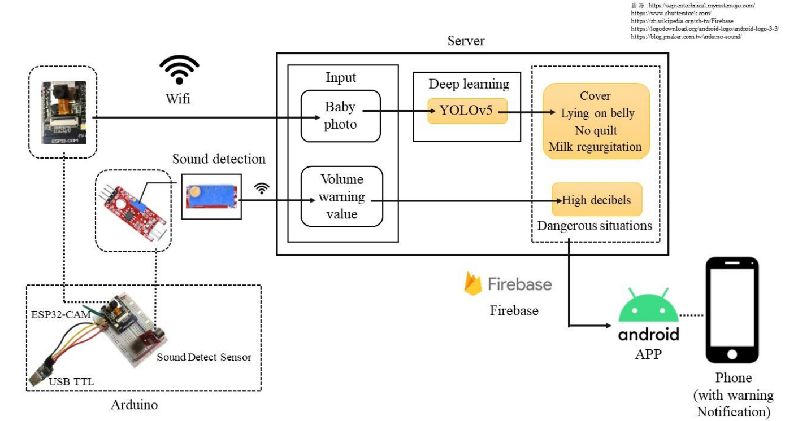

# 結合深度學習與物聯網之嬰兒安全偵測系統
 
國立東華大學資訊工程學系畢業專題

作者:林芷萱、林芯卉、黃冠瑛、梁庭瑜

指導教授:張意政

---

## 系統架構圖



---

### 開發語言

主程式、深度學習：Python

APP：Java、Kotlin

Arduino：C

---

### 開發環境

CPU：Intel(R) Core(TM) i5-9300H CPU @ 2.40GHz   2.40 GHz

GPU：GeForce GTX1650

RAM：8.00 GB

Disk：1TB HDD

---

### 使用說明

1.硬體架設

ESP32-CAM

KY-037 Sound Detect Sensor

詳細電路設置於論文內圖1

連上Wi-Fi後運行arduino.c以將ESP32-CAM板子燒到Wi-Fi內

2.主程式、深度學習

way 1:
直接使用./src/Server_Main program

way 2:
安裝YOLOv5
```
git clone https://github.com/ultralytics/yolov5
```
將Server_Main program裡的baby.yaml放入data資料夾

其餘直接放進yolov5資料夾即可

3.環境設置
```
pip install -r requirements.txt
```
參考environment.txt(內有深度學習開發環境)

4.運行

在./src/APP_Baby monitor/Baby monitor/app/release裡安裝apk檔

運行main.py

---

### 致謝

本研究感謝國科會大專生專題研究計畫(112-2813-C-259-013-E)與國科會計畫(111-2221-E-259-011-MY2)經費支持，以及國研院國網中心提供計算與儲存資源。

投稿於：

* 國科會大專生專題研究計畫，編號：112-2813-C-259-013-E
* 2023TANET，編號：T04-004
* 花蓮縣 112 年度青年鏈結地方產業
